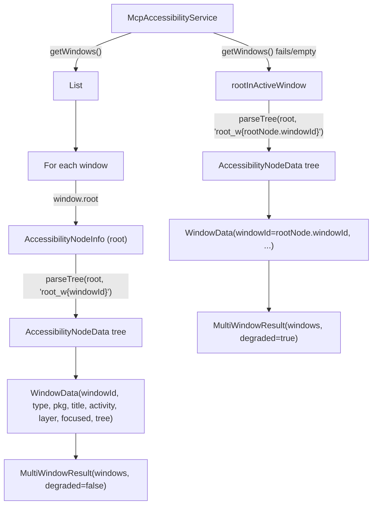

# Application Architecture

This document describes the runtime architecture of the DroidThumb Android app: **how** its components
interact at runtime. For decisions, conventions and the component list see [PROJECT.md](PROJECT.md).

The app has **no on-device server**: no listening socket, no HTTP/MCP endpoint, no tunnel (design doc D-19,
SEC-19; removed in `docs/plans/demolition.md`). The outbound transport that will carry commands from the
relay does not exist yet, so today the tool handlers are built and unit-tested but invoked by nothing.

---

## Components at runtime

| Component | Type | Lifecycle | Role |
|---|---|---|---|
| `McpAccessibilityService` | `AccessibilityService` (system-managed) | Runs while enabled in Settings → Accessibility | UI-tree capture, actions, gestures, global actions, screenshots. Singleton `instance` (`@Volatile`, companion object), set in `onServiceConnected()`, cleared in `onDestroy()` |
| Tool handlers (`mcp/tools/`) | Plain classes | Created by whatever invokes them | `execute(JsonObject?) → ToolResult`, calling the accessibility layer through injected interfaces (`ActionExecutor`, `AccessibilityServiceProvider`, `AccessibilityTreeParser`, `ElementFinder`, `ScreenCaptureProvider`, `TypeInputController`, `AppManager`, `IntentDispatcher`) |
| `McpNotificationListenerService` | `NotificationListenerService` (system-managed) | Runs while enabled in Settings → Notification access | Publishes notification changes on a shared flow |
| `EventChannelService` | Foreground service (`specialUse`) | Started from the UI or at boot (`EventChannelBootReceiver`) when enabled | Forwards notification events to the configured endpoint through `EventDispatcher` (Ktor client), with a periodic health check |
| `MainActivity` | Compose UI | User-driven | Permissions, battery exemption, Event Channel settings and control, logs |

## Service lifecycle

### Accessibility service

1. The user enables the service in Settings → Accessibility (the app deep-links there).
2. `onServiceConnected()` stores `instance`; the service runs until disabled.
3. `onDestroy()` clears `instance`.

### Event Channel

1. **Start** (UI "Start", or boot when enabled and an endpoint is set): `startForeground()` within 5 seconds,
   read `EventChannelConfig`, start the dispatcher, start the notification listener, run an immediate and then
   periodic (30 s) health check, and re-apply config changes as they arrive.
2. **Stop**: stop listeners and dispatcher, remove the foreground notification, `stopSelf()`.
3. Status is exposed as a companion-level `StateFlow` collected by the UI.

### McpNotificationListenerService

- **Connected**: `onListenerConnected()` sets the singleton instance
- **Disconnected / destroyed**: clears it
- `onLowMemory()` and `onTrimMemory()` are logged for diagnostics

## Threading Model

| Thread/Dispatcher | Responsibilities |
|---|---|
| Main | Compose UI, Activity lifecycle, AccessibilityService node operations, `onAccessibilityEvent()` |
| `Dispatchers.IO` | DataStore reads/writes, Event Channel network I/O |
| `Dispatchers.Default` | Screenshot JPEG encoding, accessibility tree parsing |

| Component | Scope | Lifecycle |
|---|---|---|
| ViewModels | `viewModelScope` | ViewModel lifecycle |
| `EventChannelService` | Custom `CoroutineScope` | `onCreate` to `onDestroy` |
| `McpAccessibilityService` | Custom `CoroutineScope` | Service lifecycle |

Thread safety: `McpAccessibilityService.instance` and `McpNotificationListenerService.instance` are
`@Volatile` singletons; accessibility node access must be on the main thread; concurrent tree access is
serialised by `AccessibilityTreeLock`.

## Permission Model

| Permission | Type | How granted | Required for |
|---|---|---|---|
| Accessibility service | Special | User enables in Settings | UI introspection, actions, screenshots (Android 11+ `takeScreenshot`) |
| Notification listener | Special | User enables in Settings → Notification access | Event Channel notification events |
| `POST_NOTIFICATIONS` | Runtime (13+) | System dialog | Event Channel foreground notification |
| `INTERNET` | Normal | Manifest | Event Channel outbound HTTP |
| `QUERY_ALL_PACKAGES` | Normal | Manifest | Launching apps, app filter |
| `KILL_BACKGROUND_PROCESSES` | Normal | Manifest | `close_app` |
| `FOREGROUND_SERVICE`, `FOREGROUND_SERVICE_SPECIAL_USE` | Normal | Manifest | `EventChannelService` |
| `RECEIVE_BOOT_COMPLETED` | Normal | Manifest | Event Channel auto-start |
| `REQUEST_IGNORE_BATTERY_OPTIMIZATIONS` | Normal (`gms` only) | Manifest + system dialog | One-tap battery exemption |

---

## Multi-Window Accessibility Architecture

The application uses Android's multi-window accessibility API (`AccessibilityService.getWindows()`) to enumerate and introspect **all** interactive windows on screen, not just the foreground app. This enables the MCP client to see and interact with system dialogs, permission popups, IME keyboards, and accessibility overlays.

### Window Discovery Flow

### Key Data Types

| Type | Description |
|------|-------------|
| `WindowData` | Window metadata (ID from `AccessibilityWindowInfo.getId()`, type, package, title, activity, layer, focused) plus the parsed `AccessibilityNodeData` tree |
| `MultiWindowResult` | List of `WindowData` plus a `degraded` flag indicating fallback to single-window mode |

### Node ID Uniqueness

Node IDs are deterministic hashes generated from the node's properties and parent chain. The `rootParentId` passed to `parseTree()` (e.g., `"root_w42"`) is the root of the hash chain, so identical nodes in different windows produce different IDs. The window ID is not appended as a visible suffix — it influences the hash internally. Example: `node_a1b2` (not `node_a1b2_w42`).

### Degraded Mode

When `getWindows()` returns empty or fails, the system falls back to `rootInActiveWindow` (single-window mode). In this mode:
- A single `WindowData` is created with `windowId` set to `rootNode.windowId` (the system-assigned window ID of the active window)
- The window type is detected via `rootNode.window?.type` when available, defaulting to `APPLICATION` otherwise
- The `MultiWindowResult.degraded` flag is set to `true`
- The TSV output includes a `note:DEGRADED` line to inform the MCP client
- Action execution falls back to `getRootNode()` for node resolution

### Cross-Window Action Execution

When executing a node-based action (click, long-click, scroll-to-node):
1. The caller provides the `List<WindowData>` from the multi-window snapshot, each containing a `windowId` (from `AccessibilityWindowInfo.getId()`)
2. `performNodeAction()` calls `getAccessibilityWindows()` to get the live window list
3. For each `WindowData`, find the matching live `AccessibilityWindowInfo` by `getId()`
4. Get the window's root `AccessibilityNodeInfo`
5. Walk the live tree in parallel with the parsed tree to find the target node by matching the deterministic node ID
6. Perform the accessibility action on the live node

### Required Configuration

The accessibility service XML config (`accessibility_service_config.xml`) must include `FLAG_RETRIEVE_INTERACTIVE_WINDOWS` in the `accessibilityFlags` attribute for `getWindows()` to return results.

---

**End of ARCHITECTURE.md**
